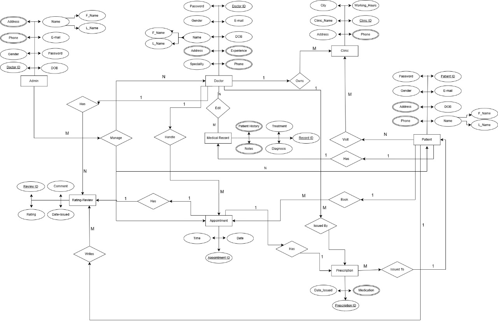
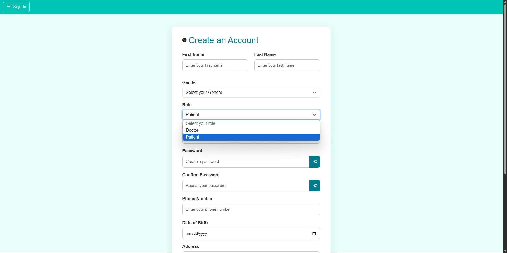
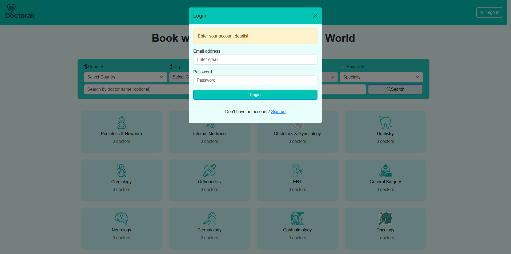
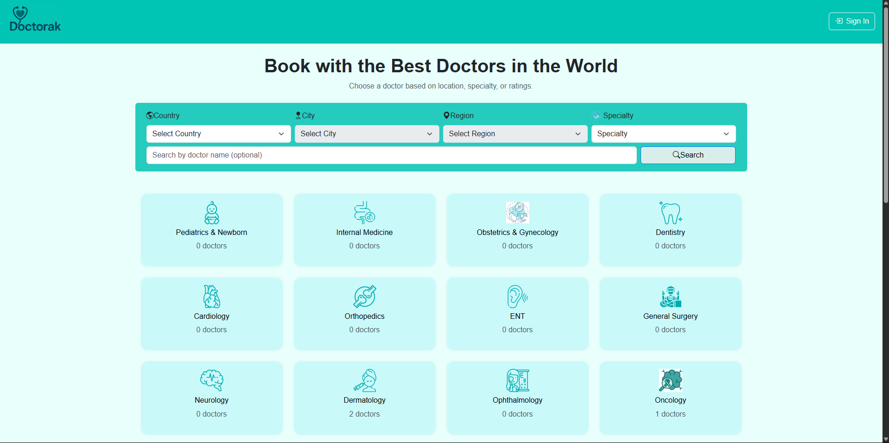
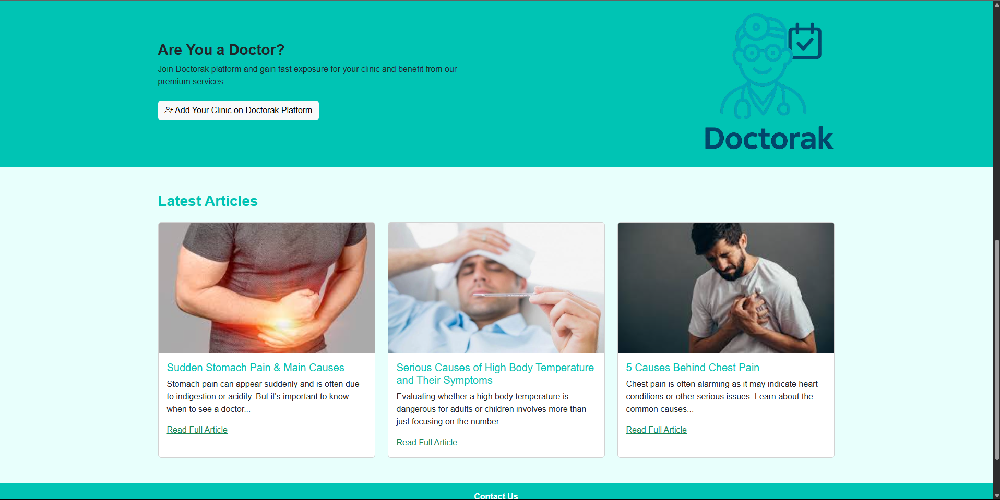
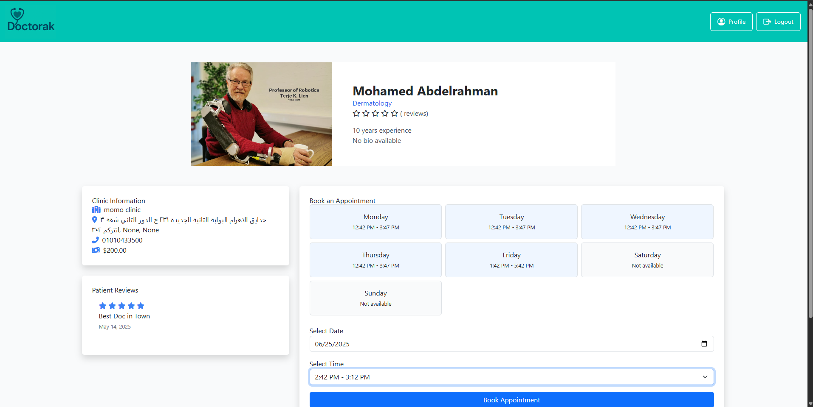
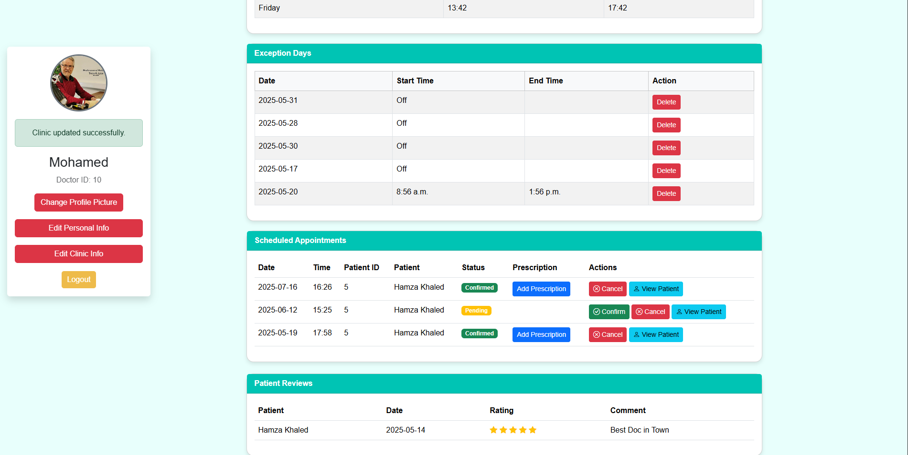
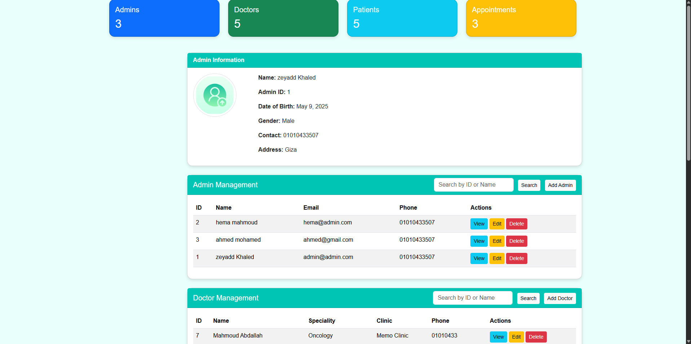
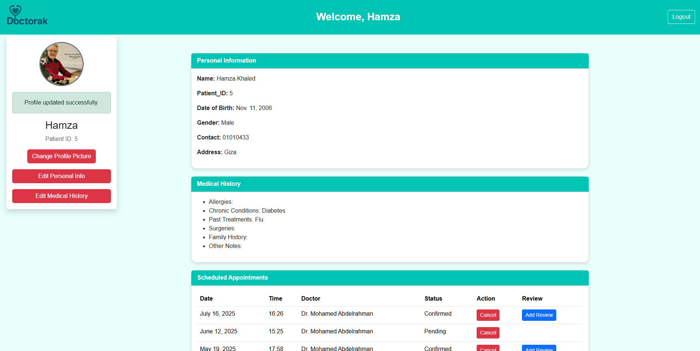
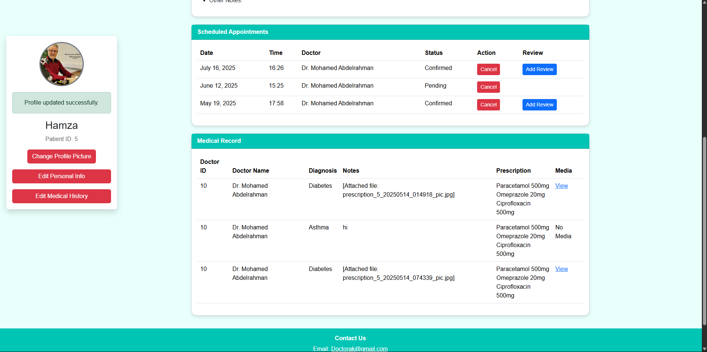

# Doctorak

**Doctorak** is a full-stack healthcare appointment booking platform inspired by Vezeeta. It allows patients to easily find and book appointments with doctors while enabling doctors to manage their schedules, patients, and medical records. The platform includes role-based authentication and an admin dashboard for full control over the system.

---

## Table of Contents

- [Features](#features)  
- [Authentication & Roles](#authentication--roles)  
- [Entity Relationship Diagram (ERD)](#entity-relationship-diagram-erd)  
- [Screenshots](#screenshots)  
- [Tech Stack](#tech-stack)  
- [Usage](#usage)  
- [Project Structure](#project-structure)  
- [Database Schema](#database-schema)  
- [Roadmap](#roadmap)  
- [Contributing](#contributing)  
- [License](#license)  
- [Author](#author)  

---

## Features

- 🩺 **Doctor Profiles** – Specialty, clinic, location, working hours  
- 👨‍⚕️ **Doctor Availability** – Weekly schedule with date-specific overrides  
- 📅 **Appointment Booking** – Patients select from real-time available time slots  
- 📂 **Medical Records** – Patient records are stored and accessible to doctors  
- 💊 **Prescriptions** – Doctors can issue prescriptions and associate them with patient records  
- 🔍 **Advanced Search** – Find doctors by specialty, clinic, and location  
- 👤 **Role-Based Dashboard** – Doctors, patients, and admins get tailored interfaces  
- 🛠 **Admin Panel** – Full control via Django admin (manage users, appointments, records)  
- 🧾 **Medical History** – Doctors can view a patient’s history across visits  
- 📱 **Responsive UI** – Works across desktop and mobile  
- 🔐 **Secure Authentication** – Using Django’s built-in user model and extensions  

---

## Authentication & Roles

Doctorak uses a custom user model extending Django's `AbstractUser`, with role-based permissions:

- **Patient**:  
  - Register & log in  
  - View doctor profiles  
  - Book appointments  
  - View medical records and prescriptions  

- **Doctor**:  
  - Register & log in  
  - Complete profile (specialty, location, etc.)  
  - Set general weekly schedule  
  - Override availability on specific dates  
  - View and manage appointments  
  - Add prescriptions to patient records  
  - View patient history  

- **Admin**:  
  - Access to Django admin panel  
  - Manage users, appointments, and system-wide data  
  - Delete or update records  

---

## Entity Relationship Diagram (ERD)


**Preview:**

```text
User (AbstractUser)
├── id (PK)
├── email
├── password
├── role (doctor/patient/admin)

DoctorProfile
├── user_id (FK to User)
├── specialty
├── clinic
├── bio
├── location

Availability
├── doctor_id (FK to DoctorProfile)
├── weekday
├── start_time
├── end_time

CustomDateOverride
├── doctor_id (FK)
├── date
├── is_available
├── custom_hours

Appointment
├── patient_id (FK to User)
├── doctor_id (FK to DoctorProfile)
├── date
├── time
├── status

Prescription
├── appointment_id (FK)
├── doctor_id (FK)
├── patient_id (FK)
├── notes
├── medications

MedicalRecord
├── patient_id (FK to User)
├── description
├── diagnosis
├── files
```





---

## Screenshots















---

## Tech Stack

**Frontend**:  
- HTML5, CSS3  
- JavaScript  
- Bootstrap (if applicable)

**Backend**:  
- Python 3.x  
- Django  
- Django rest framework
- Django Templating Engine  

**Database**:  
- PostgreSQL (hosted on [Neon](https://neon.tech))  

**Authentication**:  
- Django custom user model  
- Role-based access control  

---

## Usage

- Access via `http://localhost:8000/`  
- Register as a **patient** or **doctor**  
- Admin login available at `/admin`  
- Patients can book, view appointments, and see prescriptions  
- Doctors can set availability, manage bookings, and issue prescriptions  

---

## Project Structure

```
Doctorak/
├── doctorak/             # Django settings and URL routing
├── accounts/             # Authentication, user model, registration logic
├── doctors/              # Doctor profile, availability, schedule overrides
├── appointments/         # Booking logic, status management
├── medical/              # Medical records and prescriptions (WIP)
├── templates/            # HTML templates for all pages
├── static/               # Static files (CSS, JS, images)
├── media/                # Uploaded files, e.g., profile images
├── manage.py
├── requirements.txt
```

---

## Database Schema (Overview)

- **User** (Custom): email, username, password, role (doctor/patient/admin)  
- **DoctorProfile**: specialty, clinic, bio, location, etc.  
- **Availability**: weekday, start_time, end_time  
- **CustomDateOverride**: date, is_available, override_times  
- **Appointment**: patient, doctor, date, time, status  
- **Prescription**: doctor, patient, appointment, notes, medication list  
- **MedicalRecord**: patient, description, diagnosis, files (if any)

---

## Roadmap

- [x] Doctor and patient registration  
- [x] Doctor availability and appointment booking  
- [x] Admin panel  
- [x] Prescription system  
- [x] REST API for mobile apps  
- [x] Uploadable medical reports (PDF, images)  
- [x] Ratings and reviews for doctors  

---

## Author

**Zeyad Khaled Ezzat**  
Biomedical Data Engineering Student  
Cairo University  
Backend & Full-Stack Developer  
[LinkedIn](https://www.linkedin.com/in/zeyadkkhaled/)  
[GitHub](https://github.com/zeyadkkhaled)